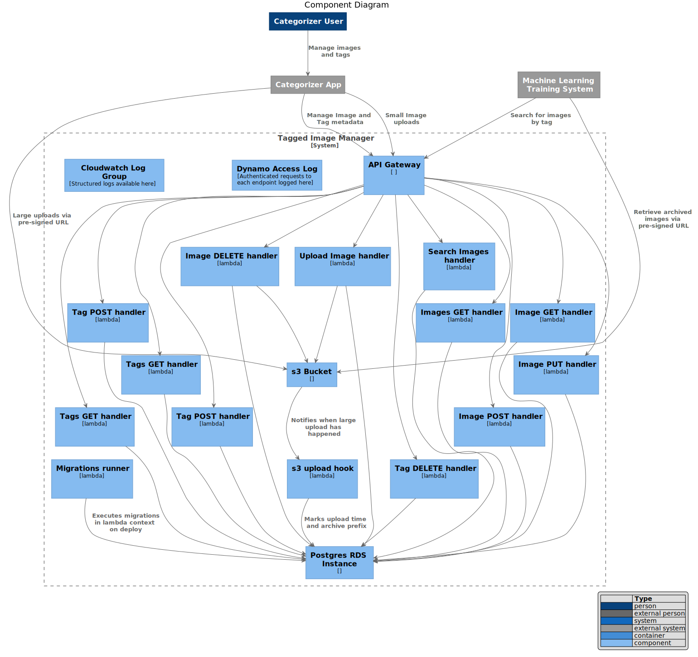
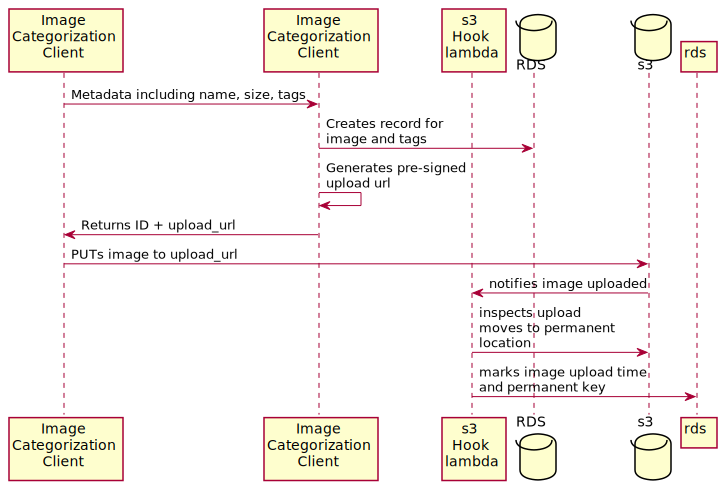

# Requirements and Design

## Requirements

The hard requirements of this challenge are to:

  * create an endpoint to manage and persist Images
  * create an endpoint to manage and persist Tags
  * have some means to associate Tags with Images
  * be secure against unit tests
  * have metadata

The nice-to-haves are:

  * track which user/client interacted with the database
  * support searching for tagged images by date

## Considered Options

There are many ways to solve this but the two which came to mind are:

  1. a containerized [Flask application](https://flask.palletsprojects.com/en/2.0.x/); or
  2. a serverless [Chalice application](https://aws.github.io/chalice/topics/authorizers.html)

I did some research into medical imaging file formats and discovered:

* the common formats are "DICOM" files with extension `.dcm`
* one source says they are ["~35 MB or larger"][1]
* samples I found [here][2], [here][3] and [here][4] are significantly less then 35MB

I am choosing Chalice / serverless approach because:

* I have recently used it to build an image + metadata upload system;
* its Cognito integration means I can have authentication without writing much code;
* it makes it easy to deploy to API Gateway and to create s3 event sources;

## System Design

The proposed system will comprise the following [Components][8]:

## API Design

The proposed API design is available in these formats:

* as an [OpenAPI 3.0.0 spec][5] for use in [compatible editors][6]
* as a [generated Markdown file][7] for human consumption

The API is protected by a Barer Token mechanism, whereby the token is an `access` token issued by Amazon Cognito User Pools.

### Uploading Images

There are two ways to upload an image as described by the documentation:

- a single shot POST to `/v1/upload` endpoint that will accept payloads up to 3.96 MB (limited by API Gateway + Lambda)

- a POST to `/v1/images` followed by a PUT to a presigned s3 url:

### Managing Images and Tags

The API docs describe usual CRUD endpoints to manage Tags and Images independently of each other.

An Image will only have a `url` and upload date if it actually present. 

The Image browsing view (`/v1/images`) is paging and allows you to specify start/end timestamps, paging offsets and limits, and to exclude images which are not present.

### Searching

There is a generic search endpoint at `/v1/search/images` which allows you to search for images by exact or matching tags. There is a performance hit to using the 'matching' function because it does a text search and supports the `%` wildcard (using `ILIKE` or similar abstraction).

The Search endpoint (`/v1/images`) is paging and allows you to specify start/end timestamps, paging offsets and limits, and to exclude images which are not present.

## User Tracking

* all requests require a valid Cognito token, which includes a user identifier
* structured logs are emitted, including the identifier, and are searchable in Cloudwatch
* all image records are tagged with the ID of the user who created them
* access to each endpoint is logged in a Dynamo DB table

---

[1]: https://www.3dbiology.com/how-to-email-dicom-images-in-3-steps/#:~:text=Digital%20imaging%20and%20communication%20in,attachment%20file%20size%20to%2010MB.
[2]: https://www.dicomlibrary.com/meddream/?study=1.2.826.0.1.3680043.8.1055.1.20111102150758591.92402465.76095170
[3]: https://www.dicomlibrary.com/meddream/?study=1.2.826.0.1.3680043.8.1055.1.20111103111148288.98361414.79379639
[4]: https://www.dicomlibrary.com/meddream/?study=1.2.826.0.1.3680043.8.1055.1.20111103112244831.40200514.30965937
[5]: design-docs/openapi/tagged-image-manager.yml
[6]: https://marketplace.visualstudio.com/items?itemName=42Crunch.vscode-openapi
[7]: design-docs/openapi/generated-tagged-image-manager.md
[8]: https://c4model.com/#ComponentDiagram